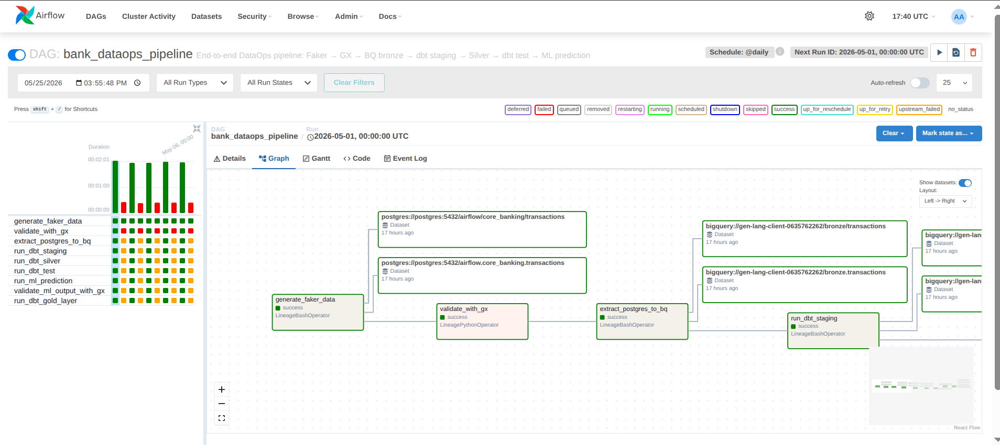
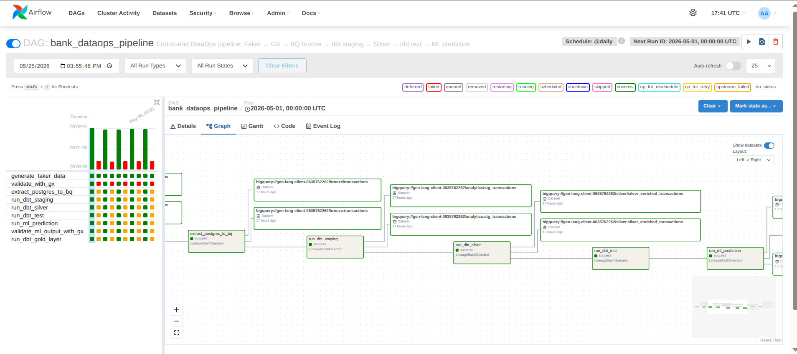
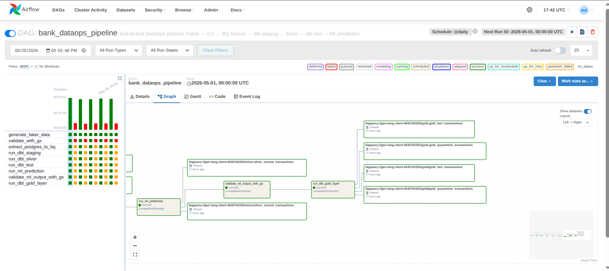
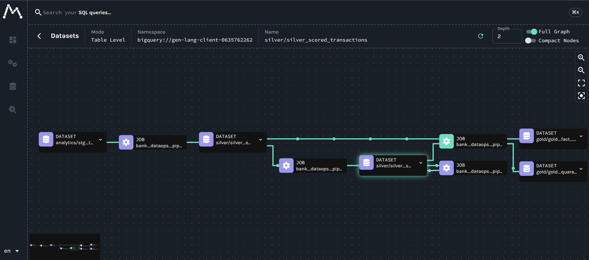
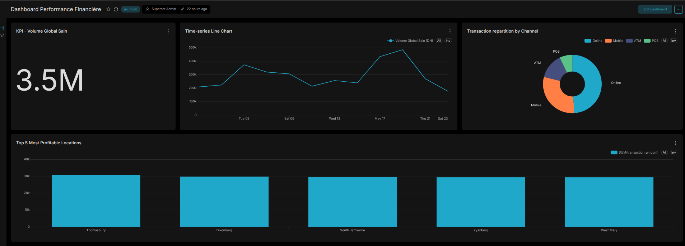
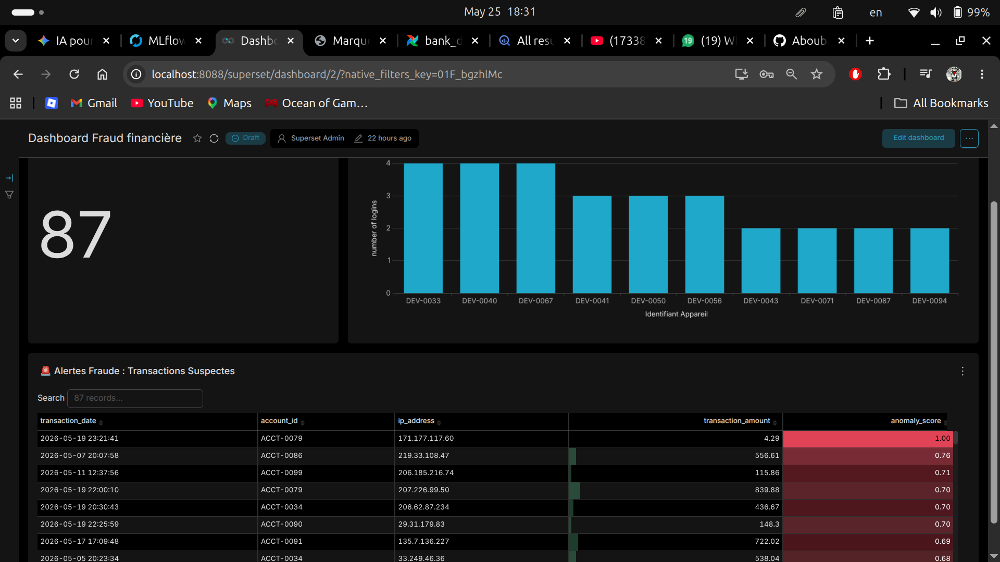
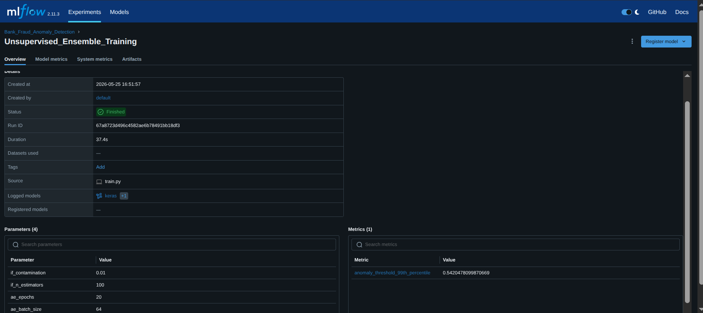
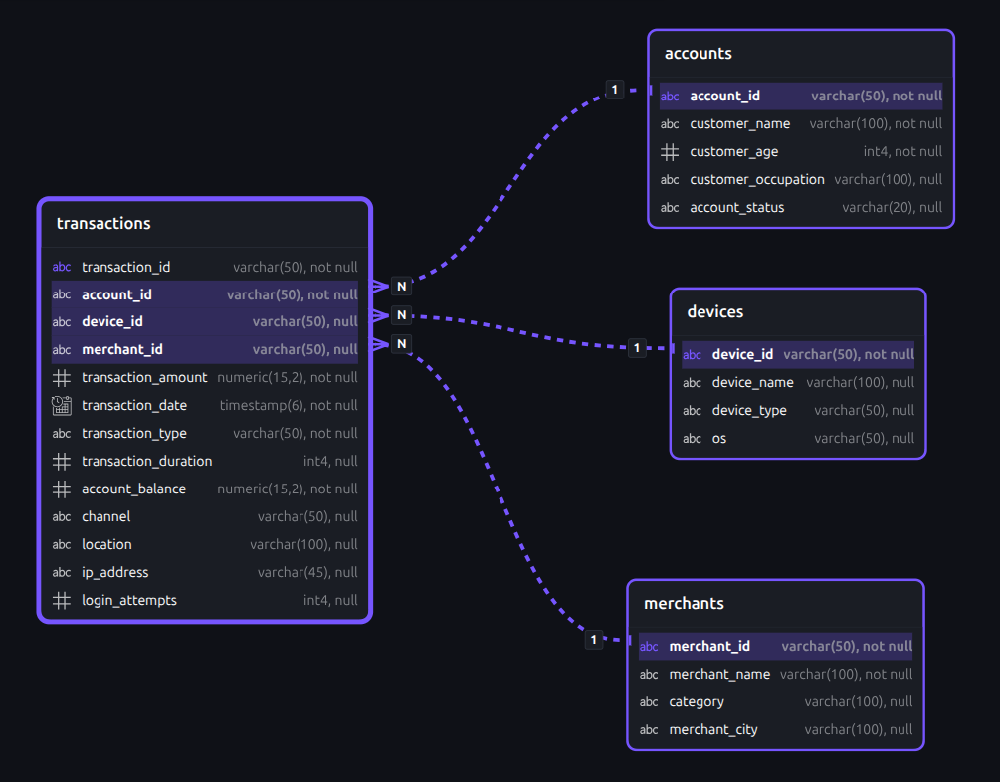
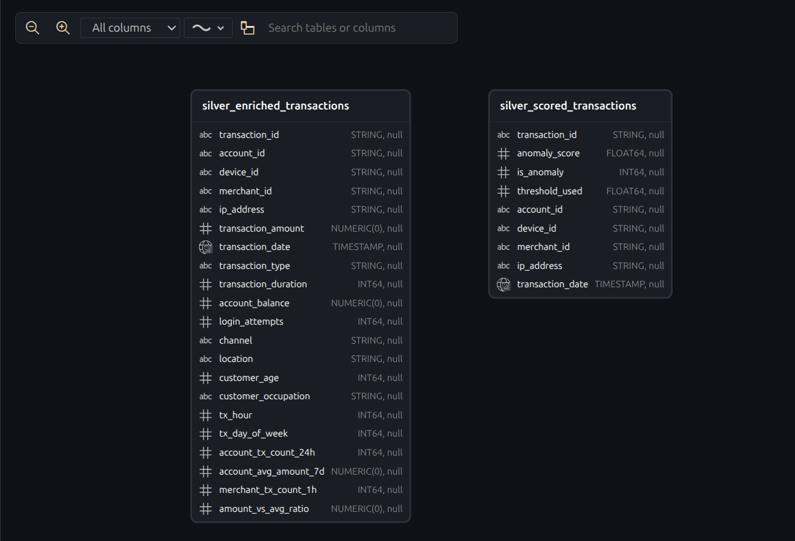
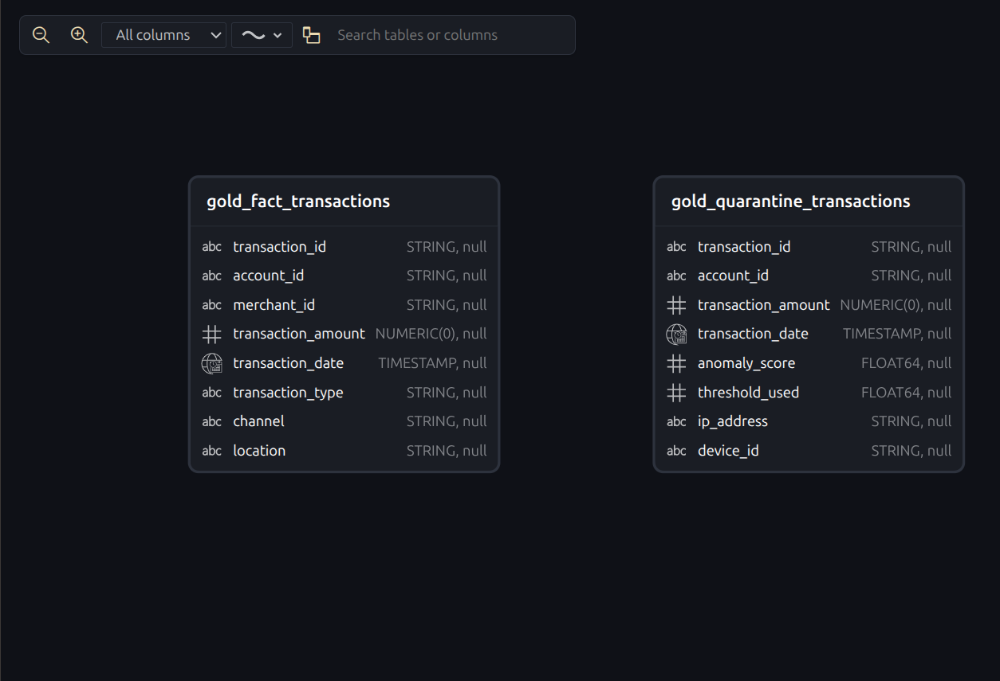

# 🏦 Enterprise Data Observability Platform

> End-to-end **DataOps** pipeline for a simulated banking environment with integrated **Chaos Engineering**, **Data Quality**, **ML Anomaly Detection**, and **Data Lineage Tracking**.

---

## 🏗️ Architecture Overview

```
┌──────────────────────────────────────────────────────────────────────┐
│  DATA SOURCE                                                         │
│  Faker → PostgreSQL (core_banking schema)                            │
│  • 85% normal data · 5% structural corruptions · 10% fraud patterns │
└──────────────┬───────────────────────────────────────────────────────┘
               │
               ▼
┌──────────────────────────────────────────────────────────────────────┐
│  AIRFLOW DAG: bank_dataops_pipeline                                  │
│                                                                      │
│  ┌────────────┐  ┌──────────┐  ┌────────────┐  ┌──────────────┐     │
│  │ 1. Faker   │─▶│ 2. GX    │─▶│ 3. PG→BQ   │─▶│ 4. dbt       │     │
│  │ (generate) │  │ (quality)│  │ (bronze)   │  │ (staging)    │     │
│  └────────────┘  └──────────┘  └────────────┘  └──────┬───────┘     │
│                                                        │             │
│  ┌────────────┐  ┌──────────┐  ┌────────────┐  ┌──────▼───────┐     │
│  │ 9. dbt     │◀─│ 8. GX ML │◀─│ 7. ML      │◀─│ 6. dbt test  │     │
│  │ (gold)     │  │ (validate│  │ (predict)  │  │ (integrity)  │     │
│  └────────────┘  └──────────┘  └────────────┘  └──────────────┘     │
│         │                                       ┌──────────────┐     │
│         └──────────────────────────────────────▶│ 5. dbt       │     │
│                                                 │ (silver)     │     │
│                                                 └──────────────┘     │
│  [OpenLineage events → Marquez Lineage Graph]                        │
└──────────────────────────────────────────────────────────────────────┘
               │
               ▼
┌──────────────────────────────────────────────────────────────────────┐
│  BIGQUERY DATA WAREHOUSE (Medallion Architecture)                    │
│  ┌────────┐  ┌───────────┐  ┌─────────┐  ┌──────────────────────┐   │
│  │ bronze │─▶│ analytics │─▶│ silver  │─▶│ gold                 │   │
│  │ (raw)  │  │ (staging) │  │(enriched│  │ fact + quarantine    │   │
│  └────────┘  └───────────┘  └─────────┘  └──────────────────────┘   │
└──────────────────────────────────────────────────────────────────────┘
               │
               ▼
┌──────────────────────────────────────────────────────────────────────┐
│  OBSERVABILITY & REPORTING                                           │
│  • Superset Dashboards (fraud alerts, financial KPIs)                │
│  • Marquez Lineage UI (data flow visualization)                      │
│  • MLflow Experiment Tracking (model versions & metrics)             │
└──────────────────────────────────────────────────────────────────────┘
```

---

## 🧱 Technology Stack

| Component             | Technology                 | Purpose                                           |
|-----------------------|----------------------------|----------------------------------------------------|
| Orchestration         | Apache Airflow 2.10        | Schedule & coordinate the pipeline                 |
| Data Transformation   | dbt-core 1.8               | SQL-based medallion architecture (Bronze→Silver→Gold) |
| Data Quality          | Great Expectations 1.17    | Validate data at source (Postgres) and ML output   |
| Data Lineage          | OpenLineage + Marquez      | End-to-end data flow tracking & impact analysis    |
| ML Anomaly Detection  | Isolation Forest + Autoencoder | Unsupervised fraud scoring                      |
| ML Experiment Tracking| MLflow 2.11                | Model versioning, metrics, and artifact storage    |
| BI Dashboards         | Apache Superset            | Real-time fraud & financial reporting              |
| Data Warehouse        | Google BigQuery            | Cloud analytical storage (free tier compatible)    |
| Source Database       | PostgreSQL 14              | Transactional data source                          |
| Containerization      | Docker Compose             | One-command deployment of all 9 services           |

---

## 📸 Interface Previews

### 1. Airflow (Orchestration & Status)




### 2. Marquez (Data Lineage)


### 3. Superset (BI & Fraud Alerting Dashboards)



### 4. MLflow (Model Tracking)


### 5. Data Architecture (BigQuery & Postgres)
**PostgreSQL OLTP (Source):**


**BigQuery Medallion Architecture:**



---

## 🚀 Quick Start (< 5 minutes)

### Prerequisites

- **Docker** & **Docker Compose** installed
- A **GCP Service Account** JSON key with BigQuery read/write permissions
- **Git**

### Step 1 — Clone the repository

```bash
git clone https://github.com/Aboubakr-Tahir/enterprise-data-observability-platform.git
cd enterprise-data-observability-platform
```

### Step 2 — Configure environment variables

```bash
cp .env.example .env
```

Edit `.env` and set your GCP project ID:

```env
GCP_PROJECT_ID=your-gcp-project-id
AIRFLOW_UID=1000          # Run: id -u  to get your user ID
SUPERSET_SECRET_KEY=generate_a_random_string_here
```

### Step 3 — Add your GCP service account key

Place your service account JSON file at the project root:

```bash
cp /path/to/your/service-account.json ./gcp-key.json
```

### Step 4 — Configure dbt profiles

```bash
cp dbt/profiles.yml.example dbt/profiles.yml
```

Edit `dbt/profiles.yml` — update `project:` with your GCP project ID and `keyfile:` with the absolute path to your `gcp-key.json`.

### Step 5 — Launch the platform

```bash
docker compose up --build -d
```

Wait ~3 minutes for all services to initialize. Check status:

```bash
docker compose ps
```

### Step 6 — Access the UIs

| Service           | URL                          | Credentials         |
|-------------------|------------------------------|----------------------|
| **Airflow**       | http://localhost:8080         | `airflow` / `airflow` |
| **Superset**      | http://localhost:8088         | `admin` / `admin`    |
| **Marquez UI**    | http://localhost:3001         | No auth required     |
| **MLflow**        | http://localhost:5050         | No auth required     |
| **Marquez API**   | http://localhost:5000         | No auth required     |

### Step 7 — Train the ML Anomaly Model

Before running the pipeline, train the Machine Learning model. Run this command to execute the training script inside the `airflow-webserver` container:

```bash
docker compose exec airflow-webserver bash -c "python /opt/airflow/mlops/train.py"
```

### Step 8 — Activate the pipeline

1. Go to Airflow → DAGs → `bank_dataops_pipeline`
2. Toggle the DAG **ON**
3. The pipeline will automatically backfill from May 1st, processing one day at a time. *(Note: Even days will intentionally fail at the GX Validation step to simulate structural corruption, while odd days will pass and be scored by the ML model!)*

### Step 9 — Import Superset Dashboards

1. Go to Superset at `http://localhost:8088` and log in with `admin` / `admin`.
2. Go to **Settings** (top right) → **Import Dashboards**.
3. Upload the `.zip` file found in the `dashboards/fraud_dashboard/` directory.
4. If prompted for a database password, enter your BigQuery credentials so the charts can load the data.

## 🔥 Chaos Engineering Strategy

The pipeline injects **deterministic, date-based anomalies** to stress-test the observability stack:

| Day Type  | Injection     | Rate | Detected By       | Pipeline Effect                          |
|-----------|---------------|------|--------------------|------------------------------------------|
| **Even**  | Structural corruption (negative amounts, `UNKNOWN` channels) | ~5%  | **GX Core** | ❌ DAG blocked → Marquez shows RED lineage |
| **Odd**   | Behavioral fraud (brute force, skimming, micro-laundering)   | ~10% | **ML Models** | ✅ GX passes → ML quarantines in Gold     |

This proves the **necessity of every tool** in the stack:
- GX alone catches structural issues but misses sophisticated fraud
- ML alone misses basic data corruption
- Together, they provide **defense in depth**

---

## 📁 Project Structure

```
enterprise-data-observability-platform/
├── dags/
│   └── bank_dataops_pipeline.py   # Main Airflow DAG (9 tasks)
├── database/
│   ├── faker_generation.py        # Synthetic data + chaos injection
│   └── pg_to_bq.py               # Postgres → BigQuery ETL
├── dbt/
│   ├── my_dbt_project/
│   │   └── models/
│   │       ├── staging/           # Bronze → Analytics views
│   │       ├── silver/            # Enriched behavioral features
│   │       └── gold/              # Business facts + quarantine
│   ├── profiles.yml.example       # Template for dbt config
│   └── dbt_project.yml
├── great_expectations/
│   ├── expectations/              # GX expectation suites
│   ├── checkpoints/               # GX checkpoint configs
│   └── great_expectations.yml     # GX main config
├── mlops/
│   ├── train.py                   # Isolation Forest + Autoencoder training
│   ├── predict.py                 # Inference pipeline (BQ → score → BQ)
│   └── validate_ml_output.py      # GX validation of ML predictions
├── dashboards/                    # Superset dashboard exports
├── docker-compose.yml             # 9-service orchestration
├── Dockerfile                     # Airflow custom image
├── Dockerfile.superset            # Superset custom image
├── requirements.txt               # Python dependencies
├── .env.example                   # Environment template
└── .gitignore
```

---

## 🔐 Security Notes

The following files contain secrets and are **excluded from version control** via `.gitignore`:

| File | Content | Action Required |
|------|---------|-----------------|
| `gcp-key.json` | GCP service account key | Place at project root |
| `.env` | Project ID, Superset secret | Copy from `.env.example` |
| `dbt/profiles.yml` | BigQuery connection config | Copy from `profiles.yml.example` |

> ⚠️ **Never commit** `gcp-key.json` or `.env` to Git.

---

## 🔧 Useful Commands

```bash
# View logs for a specific service
docker compose logs -f airflow-scheduler

# Rebuild images after dependency changes
docker compose build --no-cache

# Restart Airflow after DAG code changes
docker compose restart airflow-scheduler airflow-webserver

# Run dbt manually inside the container
docker compose exec airflow-webserver dbt run --project-dir /opt/airflow/dbt --profiles-dir /opt/airflow/dbt --target prod

# Check Marquez API
curl http://localhost:5000/api/v1/namespaces

# Stop everything
docker compose down

# Stop and remove all data (fresh start)
docker compose down -v
```

---

## 📊 Data Quality Checks

### Source Validation (GX Core — Postgres)

| Expectation | Column | Threshold |
|-------------|--------|-----------|
| `expect_column_values_to_not_be_null` | `transaction_id`, `account_id` | 100% |
| `expect_column_values_to_be_unique` | `transaction_id` | 100% |
| `expect_column_values_to_be_between` | `transaction_amount` | min=0 |
| `expect_column_values_to_be_in_set` | `channel` | `ATM`, `ONLINE`, `IN_BRANCH`, `MOBILE` |

### ML Output Validation (GX — BigQuery)

| Expectation | Column | Threshold |
|-------------|--------|-----------|
| `expect_column_values_to_be_between` | `anomaly_score` | [0, 1] |
| `expect_column_values_to_not_be_null` | `anomaly_score` | 100% |
| `expect_column_values_to_be_in_set` | `is_anomaly` | `{0, 1}` |
| `expect_column_values_to_be_unique` | `transaction_id` | 100% |

### dbt Integrity Tests (BigQuery)

| Test | Model | Purpose |
|------|-------|---------|
| `unique` | `stg_transactions.transaction_id` | No duplicate rows after transport |
| `not_null` | `stg_transactions.transaction_id` | No missing keys |

---

## 📈 Observability UIs Guide

### Airflow (Orchestration)
- **Purpose**: Monitor task execution, view logs, retry failed tasks
- **Best for**: Debugging code errors, checking execution timing

### Marquez (Data Lineage)
- **Purpose**: Trace data flow across the entire pipeline
- **Best for**: Impact analysis, understanding data dependencies, schema evolution tracking
- **How to use**: Select namespace `my_data_stack` → Jobs → click any task → enable `Full Graph` with `Depth ≥ 7`

### Superset (Business Intelligence)
- **Purpose**: Visualize fraud detection results and financial KPIs
- **Best for**: Business reporting, anomaly alerting dashboards

### MLflow (ML Experiment Tracking)
- **Purpose**: Track model versions, hyperparameters, and performance metrics
- **Best for**: Comparing model runs, reproducing experiments

---

## 📝 License

This project was built as an academic demonstration of enterprise-grade DataOps practices.
